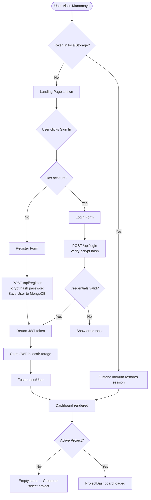
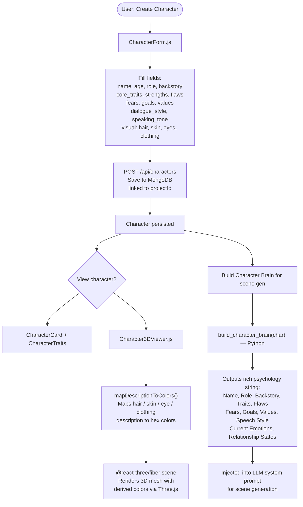
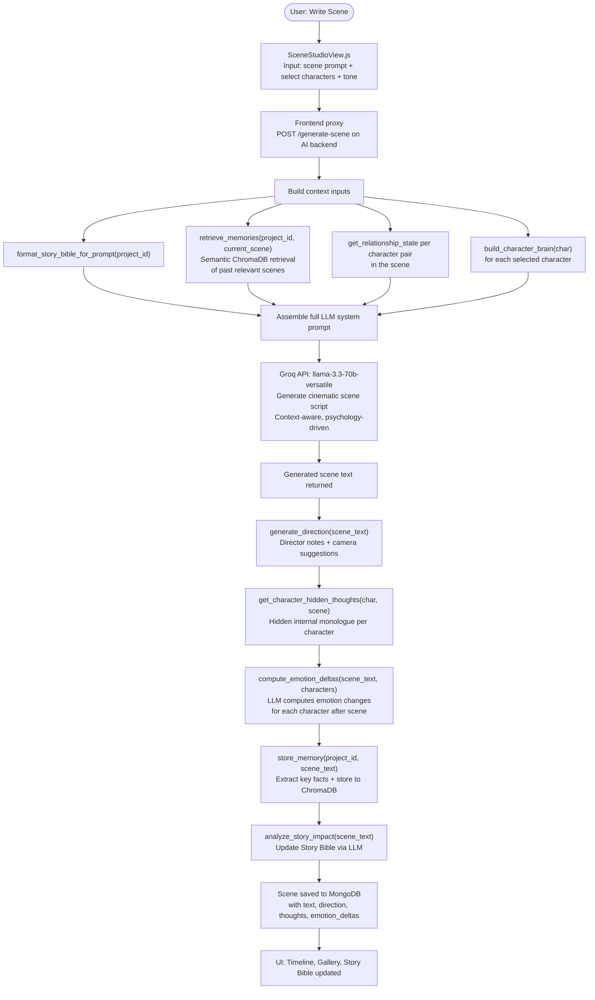
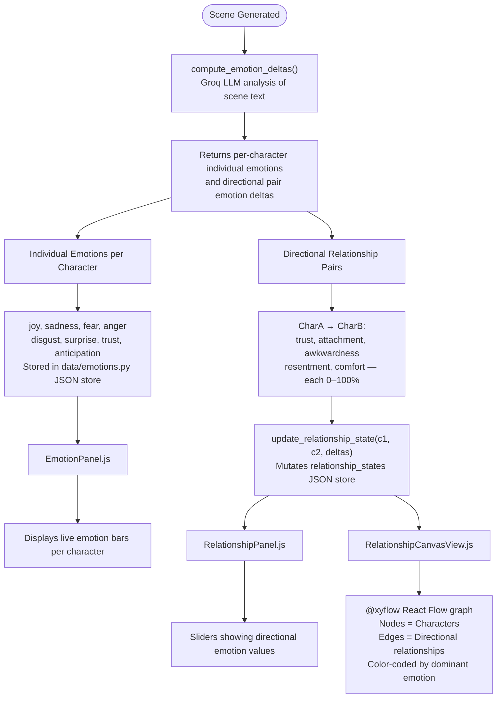
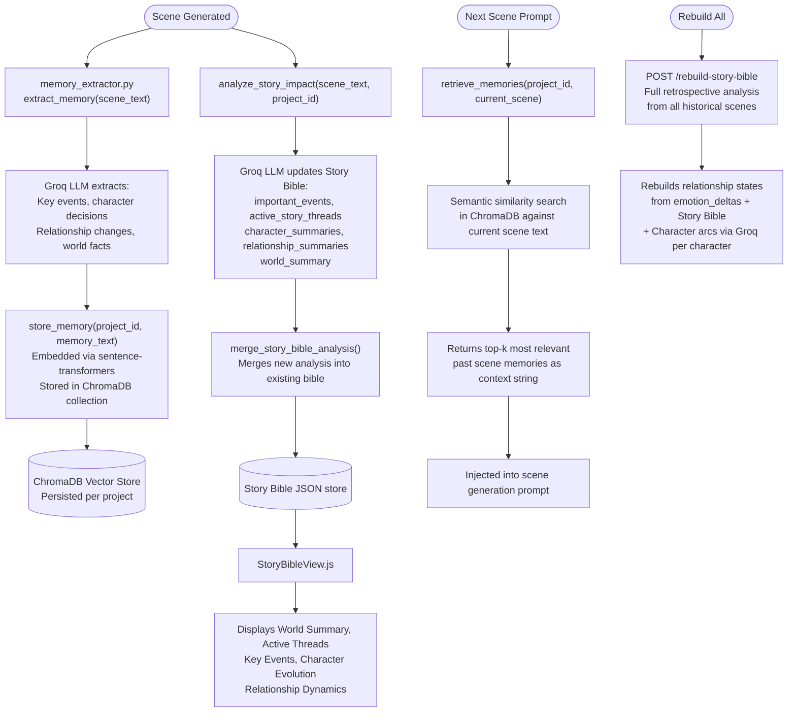
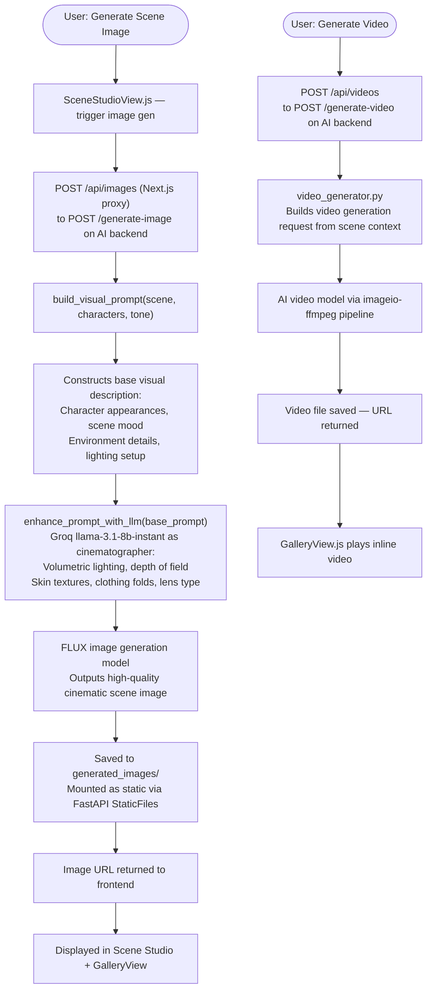
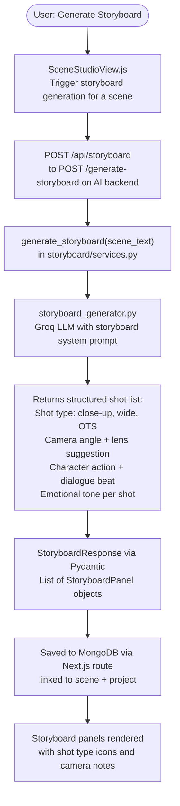
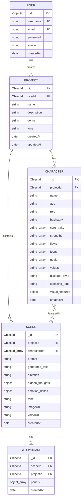

<div align="center">

# 🎭 Manomaya

### *Next-Gen AI Storytelling Engine — Characters That Think, Feel & Remember*

[](https://nextjs.org/)
[](https://react.dev/)
[](https://fastapi.tiangolo.com/)
[](https://mongodb.com/)
[](https://groq.com/)
[](https://tailwindcss.com/)
[](https://docker.com/)
[](https://threejs.org/)

> **Manomaya** is a full-stack, AI-powered creative writing and storytelling platform. Design multi-dimensional characters with rich psychology, generate emotionally intelligent cinematic scenes, track evolving relationships with live emotion graphs, generate AI scene imagery, and build a living story bible — all in one unified creative workspace.

[**Live Demo**](https://manomaya.vercel.app) · [**Report Bug**](https://github.com/Aryansinha123/Manomaya/issues) · [**Request Feature**](https://github.com/Aryansinha123/Manomaya/issues)

---

</div>

## 📑 Table of Contents

- [Overview](#-overview)
- [Key Features](#-key-features)
- [Tech Stack](#-tech-stack)
- [Project Structure](#-project-structure)
- [Architecture Overview](#-architecture-overview)
- [Application Flow Diagrams](#-application-flow-diagrams)
  - [Authentication Flow](#1-authentication-flow)
  - [Character Creation & Brain Build Flow](#2-character-creation--brain-build-flow)
  - [Scene Generation Pipeline](#3-scene-generation-pipeline)
  - [Emotion & Relationship System](#4-emotion--relationship-system)
  - [Memory & Story Bible Flow](#5-memory--story-bible-flow)
  - [Image & Video Generation Flow](#6-image--video-generation-flow)
  - [Storyboard Generation Flow](#7-storyboard-generation-flow)
- [Database Schema](#-database-schema)
- [API Reference](#-api-reference)
- [Environment Variables](#-environment-variables)
- [Getting Started](#-getting-started)
- [Docker Deployment](#-docker-deployment)
- [Contributing](#-contributing)
- [License](#-license)
- [Author](#-author)

---

## 🌟 Overview

**Manomaya** (Sanskrit: *"made of mind"*) is a production-grade AI storytelling engine that goes far beyond simple text generation. It models **characters as living psychological entities** — with traits, fears, goals, memories, and evolving emotional states — and uses them to generate rich, contextually-aware cinematic narratives.

The platform is built on a **Next.js 16 App Router** frontend with a **FastAPI Python** AI backend, connected via Docker Compose. The AI backbone runs on **Groq's ultra-fast LLaMA 3.1** inference API for scene generation, character arc analysis, story bible construction, and visual prompt enhancement. A **ChromaDB vector store** provides semantic long-term memory, allowing scenes to recall and build upon past story events.

---

## ✨ Key Features

| Category | Features |
|---|---|
| 🔐 **Auth** | JWT-based register/login, bcrypt password hashing, persistent sessions via Zustand |
| 🧠 **Character Engine** | Deep psychological profiles: traits, flaws, fears, goals, values, backstory, speech style |
| 🎭 **3D Character Viewer** | Real-time Three.js/R3F 3D mesh rendered from visual description (hair, skin, eye, clothing color mapping) |
| ✍️ **Scene Studio** | AI scene generation with multi-character support, tone control, and emotion-aware output |
| 💬 **Character Brain** | LLM prompt built from full character psychology — each character "thinks" from their own POV |
| 🧬 **Emotion System** | Per-character emotion state (joy, fear, anger…) tracked and updated after every scene |
| 💞 **Relationship Dynamics** | Directional emotion graph between all character pairs (trust, attachment, resentment, awkwardness, comfort) |
| 🗃️ **Vector Memory** | ChromaDB + sentence-transformers semantic memory — past scenes retrieved by semantic similarity |
| 📖 **Story Bible** | Auto-generated living story document: key events, active threads, character summaries, world summary |
| 📈 **Character Arc Tracking** | LLM-powered arc progression (beginning → middle → climax → resolution) with scene-by-scene history |
| 🎬 **Storyboard** | AI-generated shot-by-shot storyboard panels from scene text |
| 🖼️ **Scene Image Generation** | Cinematic FLUX-model image generation with LLM-enhanced visual prompts |
| 🎥 **Video Generation** | AI video generation from scene + character context |
| 📚 **Story Bible Rebuild** | Full retrospective bible + arc computation from all historical scenes |
| 🗂️ **Multi-Project** | Create and switch between multiple story projects with isolated memory/relationships |
| 👁️ **Gallery View** | Visual timeline of all generated scene images and videos |
| ⏱️ **Timeline View** | Chronological scene history with full detail, emotion deltas, and arc progress |
| 🔔 **Toast Notifications** | Global toast provider for all async feedback |

---

## 🛠 Tech Stack

### Frontend

| Technology | Version | Purpose |
|---|---|---|
| **Next.js** | 16.2.6 | App Router, SSR, API Routes (proxy to AI backend) |
| **React** | 19.2.4 | UI component library |
| **TailwindCSS** | 4.x | Utility-first styling |
| **Framer Motion** | 12.40.0 | Animations, transitions, panel reveals |
| **Three.js / @react-three/fiber** | ^9.6.1 | 3D character mesh rendering |
| **@react-three/drei** | ^10.7.7 | 3D helper abstractions (OrbitControls, etc.) |
| **@xyflow/react** | ^12.10.2 | Relationship canvas node graph visualization |
| **Lucide React** | ^1.16.0 | Icon system |
| **Zustand** | ^5.0.13 | Global client-side state management |
| **Axios** | ^1.16.1 | HTTP client |

### AI Backend

| Technology | Version | Purpose |
|---|---|---|
| **FastAPI** | >=0.100.0 | High-performance async REST API |
| **Uvicorn** | >=0.22.0 | ASGI server |
| **Pydantic** | >=2.0 | Request/response schema validation |
| **Groq SDK** | >=0.9.0 | LLaMA 3.1 inference (scene gen, arc, bible, prompts) |
| **ChromaDB** | >=0.4.0 | Vector database for semantic scene memory |
| **sentence-transformers** | >=2.2.2 | Sentence embeddings for ChromaDB |
| **Pillow** | >=10.0.0 | Image processing |
| **imageio-ffmpeg** | >=0.4.8 | Video generation pipeline |
| **python-dotenv** | >=1.0.0 | Environment variable management |

### Data Layer

| Technology | Purpose |
|---|---|
| **MongoDB Atlas** | Projects, characters, scenes, storyboard data (via Next.js API routes) |
| **ChromaDB** | Persistent semantic vector store for scene memories (AI backend) |
| **JSON file store** | Fast in-process emotion states, relationship states, character arcs (AI backend) |

### DevOps

| Tool | Purpose |
|---|---|
| **Docker Compose** | Multi-service orchestration (frontend + AI backend) |
| **Railway** | AI backend cloud deployment |
| **Vercel** | Frontend deployment |
| **ESLint 9** | Code quality |

---

## 📁 Project Structure

```
manomaya/
├── docker-compose.yml              # Multi-service Docker orchestration
│
├── frontend/                       # Next.js 16 App Router application
│   ├── app/
│   │   ├── layout.js               # Root layout with global providers
│   │   ├── page.js                 # Landing page / Main dashboard
│   │   ├── globals.css             # Global styles + Tailwind base
│   │   └── api/                    # Next.js serverless API routes (proxy + DB)
│   │       ├── login/              # POST /api/login — JWT auth
│   │       ├── register/           # POST /api/register — user creation
│   │       ├── profile/            # GET /api/profile — user info
│   │       ├── projects/           # CRUD for story projects
│   │       ├── characters/         # CRUD for characters
│   │       ├── relationships/      # Relationship state proxy
│   │       ├── story-bible/        # Story Bible data proxy
│   │       ├── storyboard/         # Storyboard generation proxy
│   │       ├── images/             # Scene image generation proxy
│   │       ├── videos/             # Video generation proxy
│   │       ├── character-arc/      # Character arc data proxy
│   │       └── character-summary/  # Character summary proxy
│   │
│   ├── components/
│   │   ├── Sidebar.js              # Project/nav sidebar
│   │   ├── CharacterStudio.js      # Full character CRUD + 3D viewer studio
│   │   ├── CharactersView.js       # Characters list & overview
│   │   ├── SceneStudioView.js      # Scene generation UI
│   │   ├── StoryBibleView.js       # Story Bible display
│   │   ├── TimelineView.js         # Chronological scene history
│   │   ├── RelationshipCanvasView.js # @xyflow node graph for relationships
│   │   ├── GalleryView.js          # Scene image/video gallery
│   │   ├── MemoriesView.js         # Memory log viewer
│   │   ├── Character3DViewer.js    # Three.js/R3F 3D mesh viewer
│   │   ├── CharacterCard.js        # Character summary card
│   │   ├── CharacterForm.js        # Character creation/edit form
│   │   ├── CharacterTraits.js      # Trait tag display
│   │   ├── RelationshipPanel.js    # Relationship emotion sliders
│   │   ├── EmotionPanel.js         # Per-character emotion display
│   │   ├── AuthCard.js             # Login/register modal card
│   │   ├── DashboardView.js        # Project home dashboard
│   │   ├── ProjectDashboard.js     # Project-level layout router
│   │   ├── SettingsView.js         # User settings
│   │   ├── SceneInput.js           # Scene prompt input
│   │   ├── ToastProvider.js        # Global toast notification system
│   │   └── storyboard/             # Storyboard sub-components
│   │
│   ├── lib/
│   │   ├── api.js                  # Axios instance pointing to AI backend
│   │   ├── auth.js                 # Token storage helpers
│   │   ├── mongodb.js              # Mongoose connection singleton
│   │   ├── emotionUtils.js         # Emotion state helpers & defaults
│   │   ├── storyBibleUtils.js      # Story bible formatting utilities
│   │   └── storyboardApi.js        # Storyboard API client
│   │
│   └── store/
│       └── useStore.js             # Zustand global store (auth, project, scenes, chars)
│
└── ai-backend/                     # FastAPI Python AI engine
    ├── main.py                     # All API routes (1154 lines)
    ├── groq_utils.py               # Groq client helpers, truncation
    ├── director_engine.py          # Scene direction generation
    ├── image_generator.py          # FLUX image generation
    ├── video_generator.py          # AI video generation
    ├── visual_prompt_engine.py     # LLM-enhanced cinematic prompt builder
    ├── entrypoint.py               # Alternative entrypoint
    ├── character_engine/
    │   ├── arc_analyzer.py         # Character arc computation
    │   └── thought_engine.py       # Hidden character thought generation
    ├── prompt_builders/
    │   └── character_brain.py      # Builds full character psychology prompt
    ├── memory/
    │   └── memory_store.py         # In-process scene memory list
    ├── vector_memory/
    │   ├── memory_engine.py        # ChromaDB store & semantic retrieval
    │   ├── memory_extractor.py     # LLM-based memory extraction from scenes
    │   ├── chroma_client.py        # ChromaDB client singleton
    │   └── embedding_model.py      # Sentence-transformers embedding model
    ├── story_bible/
    │   └── story_bible_engine.py   # Story Bible CRUD + Groq analysis
    ├── storyboard/
    │   ├── schemas.py              # Storyboard Pydantic schemas
    │   ├── services.py             # Storyboard service orchestration
    │   ├── storyboard_generator.py # LLM storyboard shot generation
    │   └── prompts.py              # Storyboard system prompts
    └── data/
        ├── emotions.py             # Per-character emotion state store
        ├── relationships.py        # Directional relationship state store
        └── character_arcs.py       # Character arc progression store
```

---

## 🏗 Architecture Overview

```
┌────────────────────────────────────────────────────────────────┐
│                        USER BROWSER                            │
│                    Next.js 16 Frontend                         │
│   ┌──────────┐  ┌──────────────┐  ┌──────────────────────┐   │
│   │ Zustand  │  │  React / R3F │  │  @xyflow Relationship │   │
│   │  Store   │  │  3D Viewer   │  │    Canvas Graph       │   │
│   └──────────┘  └──────────────┘  └──────────────────────┘   │
└───────────────────────────┬────────────────────────────────────┘
                            │ HTTP / Next.js API Routes
          ┌─────────────────┴──────────────────────┐
          │                                        │
   ┌──────▼────────┐                     ┌─────────▼──────────┐
   │  MongoDB Atlas │                     │  FastAPI AI Backend │
   │  (Projects,   │                     │  (Railway / Docker) │
   │  Characters,  │                     │                     │
   │  Scenes,      │                     │  ┌────────────────┐ │
   │  Storyboard)  │                     │  │  Groq LLaMA 3.1│ │
   └───────────────┘                     │  │  (Scene Gen,   │ │
                                         │  │  Arc, Bible,   │ │
                                         │  │  Prompts)      │ │
                                         │  └────────────────┘ │
                                         │  ┌────────────────┐ │
                                         │  │  ChromaDB      │ │
                                         │  │  Vector Store  │ │
                                         │  │  (Memories)    │ │
                                         │  └────────────────┘ │
                                         │  ┌────────────────┐ │
                                         │  │  FLUX Image    │ │
                                         │  │  Generator     │ │
                                         │  └────────────────┘ │
                                         └─────────────────────┘
```

---

## 🔄 Application Flow Diagrams

### 1. Authentication Flow



---

### 2. Character Creation & Brain Build Flow



---

### 3. Scene Generation Pipeline



---

### 4. Emotion & Relationship System



---

### 5. Memory & Story Bible Flow



---

### 6. Image & Video Generation Flow



---

### 7. Storyboard Generation Flow



---

## 🗄 Database Schema

Manomaya uses **MongoDB Atlas** (via Next.js API routes) for persistent project and story data, and **ChromaDB + JSON file stores** in the AI backend for fast-access emotion and memory state.



> **AI Backend Data Stores** *(in-process, persisted as JSON on disk):*
> - `data/emotions.py` — Per-character individual emotion states, keyed by `(character_name, project_id)`
> - `data/relationships.py` — Directional relationship emotion states, keyed by `(charA→charB, project_id)`
> - `data/character_arcs.py` — Character arc progress and scene-by-scene history
> - `story_bible/` — Story bible JSON per project
> - `chroma_db/` — ChromaDB persistent vector store for semantic scene memories

---

## 📡 API Reference

### Frontend — Next.js API Routes (→ MongoDB)

| Method | Endpoint | Description |
|---|---|---|
| `POST` | `/api/register` | Register a new user |
| `POST` | `/api/login` | Login, returns JWT token |
| `GET` | `/api/profile` | Get authenticated user profile |
| `GET/POST` | `/api/projects` | List / create story projects |
| `GET/PATCH/DELETE` | `/api/projects/:id` | Single project CRUD |
| `GET/POST` | `/api/characters` | List / create characters for a project |
| `GET/PATCH/DELETE` | `/api/characters/:id` | Single character CRUD |
| `GET/POST` | `/api/storyboard` | Fetch or trigger storyboard generation |
| `GET/POST` | `/api/images` | Proxy to AI image generation |
| `GET/POST` | `/api/videos` | Proxy to AI video generation |
| `GET` | `/api/character-arc` | Fetch character arc data |
| `GET` | `/api/character-summary` | Fetch AI-generated character summary |
| `GET/POST` | `/api/relationships` | Proxy to relationship state |
| `GET` | `/api/story-bible` | Proxy to story bible data |

### AI Backend — FastAPI

| Method | Endpoint | Description |
|---|---|---|
| `GET` | `/` | Health check |
| `POST` | `/generate-scene` | Main scene generation endpoint |
| `POST` | `/generate-storyboard` | Shot-by-shot storyboard generation |
| `POST` | `/generate-image` | Cinematic scene image generation |
| `POST` | `/generate-video` | AI video generation |
| `GET` | `/story-bible` | Retrieve current story bible |
| `POST` | `/rebuild-story-bible` | Retrospective bible + arc rebuild from all scenes |
| `POST` | `/chat` | Simple raw Groq chat completion |

Interactive API docs available at `http://localhost:8000/docs` when the backend is running.

---

## 🔐 Environment Variables

### Frontend — `frontend/.env.local`

```env
# MongoDB Atlas
MONGODB_URI=mongodb+srv://<user>:<password>@cluster.mongodb.net/manomaya

# JWT Authentication
JWT_SECRET=your_jwt_secret_here

# AI Backend URL (used server-side in Next.js API routes)
AI_BACKEND_URL=http://localhost:8000

# AI Backend URL (used client-side for direct calls)
NEXT_PUBLIC_AI_BACKEND_URL=http://localhost:8000
```

### AI Backend — `ai-backend/.env`

```env
# Groq API — LLaMA 3.1 inference
GROQ_API_KEY=your_groq_api_key_here

# Hugging Face token (for sentence-transformers model download)
HF_TOKEN=your_hf_token_here
```

> **Docker Compose:** All variables are declared in a single root `.env` file and mapped per service via `docker-compose.yml`.

---

## 🚀 Getting Started

### Prerequisites

- **Node.js** 18+
- **Python** 3.10+
- **MongoDB Atlas** account — [create free cluster](https://cloud.mongodb.com)
- **Groq API** account — [get a key](https://console.groq.com)
- **Hugging Face** account — [get a token](https://huggingface.co/settings/tokens) *(for sentence-transformers)*

---

### Option A — Manual Local Development

#### 1. Clone the repository

```bash
git clone https://github.com/Aryansinha123/Manomaya.git
cd Manomaya
```

#### 2. Start the AI Backend

```bash
cd ai-backend

# Create and activate a virtual environment
python -m venv venv
venv\Scripts\activate        # Windows
# source venv/bin/activate   # macOS / Linux

# Install dependencies
pip install -r requirements.txt

# Configure environment
# Create ai-backend/.env with your GROQ_API_KEY and HF_TOKEN

# Start the FastAPI server
uvicorn main:app --reload --port 8000
```

Backend available at → `http://localhost:8000`  
Swagger docs at → `http://localhost:8000/docs`

#### 3. Start the Frontend

```bash
cd frontend

# Install dependencies
npm install

# Configure environment
# Create frontend/.env.local with MONGODB_URI, JWT_SECRET, AI_BACKEND_URL

# Start the development server
npm run dev
```

Open [http://localhost:3000](http://localhost:3000) in your browser.

---

### Option B — Docker Compose *(Recommended)*

```bash
git clone https://github.com/Aryansinha123/Manomaya.git
cd Manomaya

# Create a root .env file
cat > .env << 'EOF'
GROQ_API_KEY=your_groq_api_key
HF_TOKEN=your_hf_token
MONGODB_URI=mongodb+srv://<user>:<password>@cluster.mongodb.net/manomaya
JWT_SECRET=your_jwt_secret
NEXT_PUBLIC_AI_BACKEND_URL=http://localhost:8000
EOF

# Build and start both services
docker compose up --build
```

| Service | URL |
|---|---|
| Frontend | `http://localhost:3000` |
| AI Backend | `http://localhost:8000` |
| Swagger Docs | `http://localhost:8000/docs` |

---

## 🐳 Docker Deployment

The `docker-compose.yml` orchestrates two services:

| Service | Build Context | Port | Notes |
|---|---|---|---|
| `backend` | `./ai-backend` | `8000` | FastAPI + Groq + ChromaDB |
| `frontend` | `./frontend` | `3000` | Next.js production build |

**Persistent Docker volumes:**
- `backend-images` — Generated scene images survive container restarts
- `backend-chroma` — ChromaDB vector store data persisted across deployments

---

## 🌐 Production Deployment

### AI Backend → Railway

```bash
npm install -g @railway/cli
cd ai-backend
railway login && railway init && railway up
```

Set `GROQ_API_KEY` and `HF_TOKEN` in the Railway dashboard under **Variables**.

### Frontend → Vercel

```bash
npm install -g vercel
cd frontend
vercel --prod
```

Set all `frontend/.env.local` variables in Vercel under **Settings → Environment Variables**.  
Update `AI_BACKEND_URL` and `NEXT_PUBLIC_AI_BACKEND_URL` to your Railway deployment URL.

---

## 🤝 Contributing

Contributions are welcome! Please follow these steps:

1. Fork the repository
2. Create a feature branch: `git checkout -b feature/your-feature-name`
3. Commit your changes: `git commit -m 'feat: describe your change'`
4. Push to the branch: `git push origin feature/your-feature-name`
5. Open a Pull Request

### Pending Features / Good First Issues

- [ ] Real-time collaborative scene writing (WebSocket support)
- [ ] Character voice TTS narration (ElevenLabs / Kokoro integration)
- [ ] Export story as formatted PDF / EPUB
- [ ] Genre-specific system prompts (horror, romance, thriller, sci-fi)
- [ ] Scene branching and alternate timeline support
- [ ] Public project sharing and community gallery
- [ ] Mobile-responsive UI overhaul
- [ ] Rate limiting and abuse protection on AI endpoints
- [ ] Unit tests for AI backend modules
- [ ] Persistent relationship + emotion states in MongoDB (currently JSON file store)

---

## 📄 License

This project is licensed under the **MIT License**.

---

## 👤 Author

**Aryan Sinha**

[](https://github.com/Aryansinha123)

---

<div align="center">

**Manomaya** — Built with imagination and coffee by Aryan Sinha

*"Manomaya" (Sanskrit: मनोमय) — made of mind, born from thought.*

</div>
